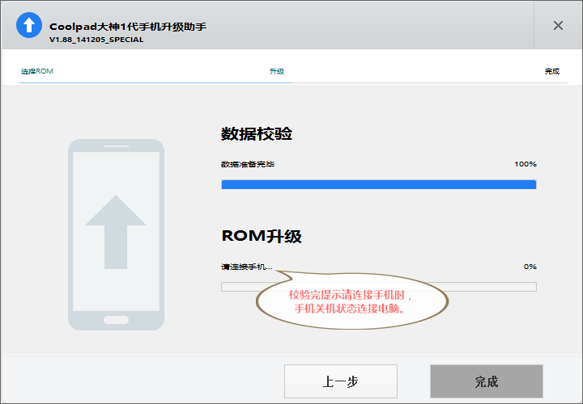

酷派大神9976A和1S线刷教程
=================
## 1.下载必要文件
```
链接: http://yun.baidu.com/s/1eSjnS90
```
## 2.安装手机驱动（安装驱动前请先禁用系统驱动程序签名强制）
```
A.禁用系统驱动程序签名强制方法：
   Win7：电脑开机按F8，出现安全模式界面时选最下面的禁用驱动程序签名强制即可。
   Win8-10：点击设置--更新和安全--恢复--点击“高级启动”下的“立即重启”--重启后选择“疑难解答”--高级选项--启动设置--重启--按提示输入“7”禁用驱动程序强制签名。
```   
B.解压缩```大神救砖驱动.zip```，安装```大神官方驱动.exe```。
安装完成后手机进入```关机状态```。
将手机连接电脑，打开设备管理器


如果手机显示是这样的表示驱动安装正常
如果不是，打开刚刚的```大神救砖驱动.zip```里解压出来的```刷机驱动自动安装版和WIN7装这个和官方驱动```文件夹


点击下一步即可更新成功
## 3.安装CDA线刷工具


解压```酷派CDA自助升级工具V1.88_141205_SPCIAL.rar```，安装里面的程序
## 4.开始刷机
手机进入```关机状态```，和电脑断开。
提前下载好```4.4.034.P2.150415.9976A.CPB 或 4.4.034.P0.150415.9976T.CPB```
打开CDA并选中```下载好的CPB文件```所在的路径





## 一些额外的注意事项
刷机前请关闭如应用宝、360手机助手、豌豆夹等之类的手机管理软件后再运行```CDA```

否则```CDA```会提示无法刷机

PS:这是我在测试发现的，记得在教程的右上角给我加```star```
